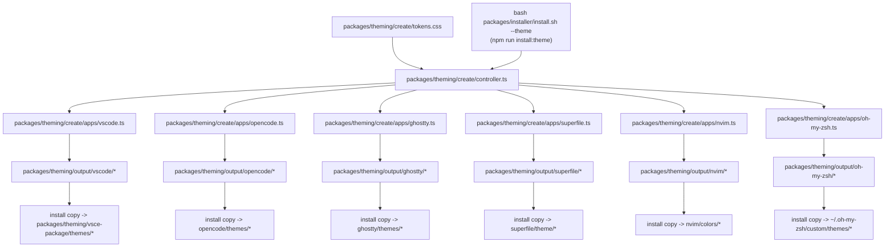

# Theme Generation Diagram

The Zsh prompt reads the saved machine color from `~/.dotfiles/machine.json`.
The machine-name block uses white text on black and black text on every other
supported color.
