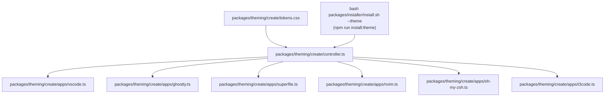

# Theme Generation Diagram

```mermaid
flowchart TD
  A["packages/theming/create/tokens.css"] --> B["packages/theming/create/controller.ts"]
  B --> C["packages/theming/create/apps/vscode.ts"]
  B --> E["packages/theming/create/apps/ghostty.ts"]
  B --> F["packages/theming/create/apps/superfile.ts"]
  B --> G["packages/theming/create/apps/nvim.ts"]
  B --> H["packages/theming/create/apps/oh-my-zsh.ts"]
  B --> V["packages/theming/create/apps/t3code.ts"]

  U["bash packages/installer/install.sh --theme\n(npm run install:theme)"] --> B
```

The Zsh prompt reads the saved machine color from `~/.dotfiles/machine.json`.
The machine-name block uses white text on black and black text on every other
supported color.

The T3 Code export stays in one file. Its dark palette is the base `colors`
object and its macOS light palette is stored in `variants.light`. Import
`packages/theming/g-theme-t3.json` from T3 Code Settings → Themes → Import
theme.
